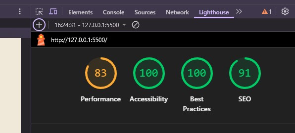
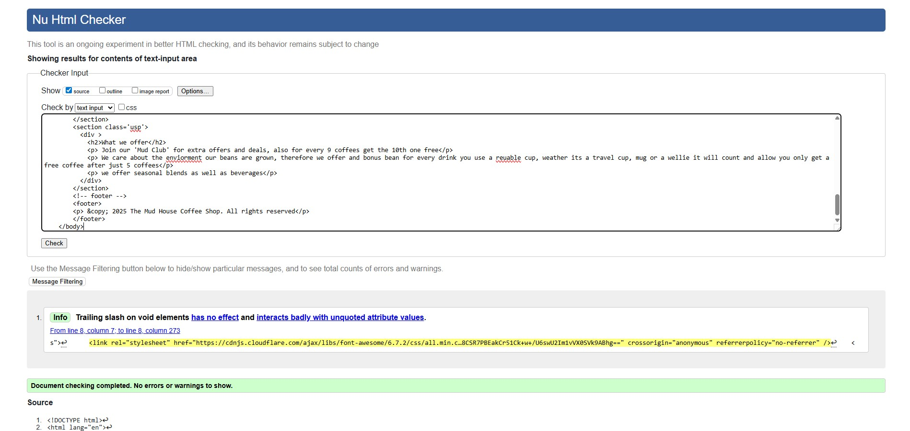
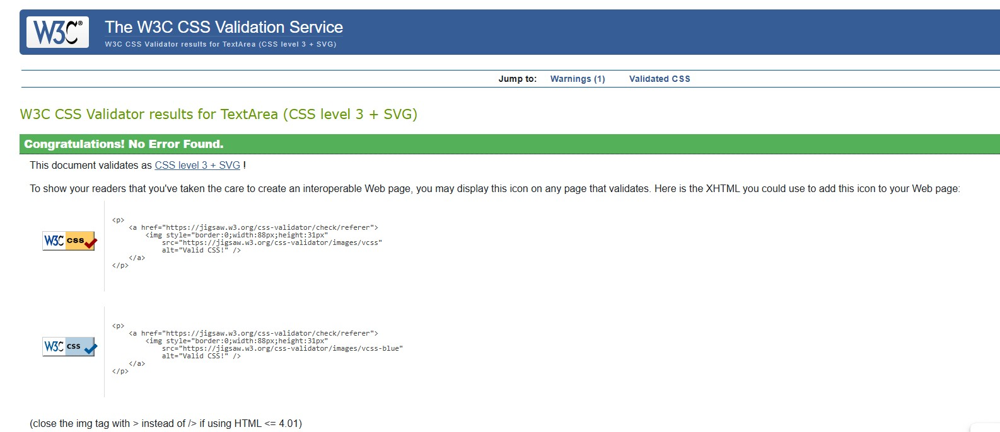

# Local Business Cafe
website for a fictional cafe to promote their services

## Features
 - homepage: giving USps and welcome to the cafe 
 - Contact page: where to find the cafe, opening times and and contact information and form.
 - Category page: holding links to the drinks menu, food menus
 - Product page: for the purchaseable products. 

## Technologies used
- HTML
- CSS
- Javascript

## Sources Used 
- stylesheet for navigation : https://cdnjs.cloudflare.com/ajax/libs/font-awesome/6.7.2/css/all.min.css

## Accessibility 
- I have run the lighthouse inspection to check the accessbility level of my site:
  

## Valitation
- I ran my code through a code validator to ensure there are no error:
   html : https://validator.w3.org/#validate_by_input 
   css :  https://jigsaw.w3.org/css-validator/  

## Getting Started

## Deployment
 - Deployement to GitHub Pages. The steps to deploy are as follows:
 1. In the [GitHub respository](https://github.com/SarahAnderson15/coffee_shop), navigate to the settings tab.
 2. From the source section drop-down menu, select the Main Branch, then click "Save".
 3. The page will be automatically refreshed with a detailed ribbion display to indicate the successful deployment. 
  The live link can be found [here](https://SarahAnderson15.github.io/coffee_shop) 